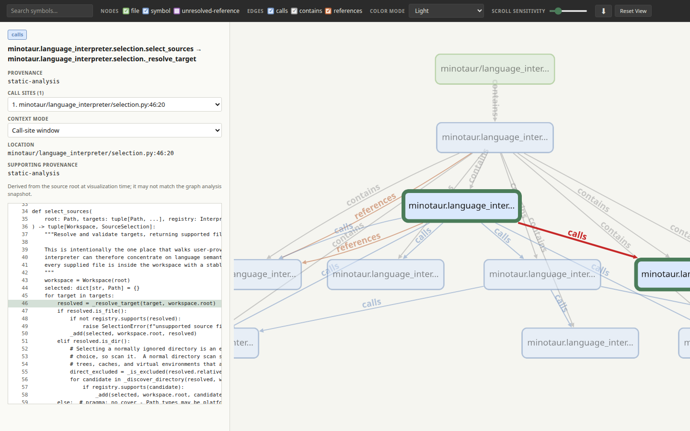

# Minotaur

> A local-first toolkit for turning source code into
> evidence-backed software architecture maps.

Minotaur helps engineers explore how software is structured and which
relationships can be established from source code. It interprets supported
languages, normalizes those facts into one canonical graph, and creates
portable interactive visualizations.

The project is intentionally designed around traceability: a graph should make
clear what was established by static analysis, what was supplied as a rule,
and what remains unresolved.

[](https://d10-analytics.github.io/Minotaur/)

[Try the live demo](https://d10-analytics.github.io/Minotaur/) or
[download and open the offline HTML](examples/python-workflow/minotaur-graph.html).
To intentionally refresh the preview, install the `visualizer` extra and
Chromium, then run `python3 scripts/capture_python_workflow_demo.py`.
The embedded preview predates the bundled example's `--root src` re-rooting;
it remains a visual placeholder until that browser-backed capture is refreshed.

## Current capabilities

Minotaur is in early development. Its current implementation includes:

- a versioned canonical graph schema, tested graph model, and semantic validator;
- a bounded native Python analyzer and selected-path CLI (currently `.py` only);
- fixed agent-facing graph queries for callers, definitions, impact,
  unreferenced symbols, snapshot diffs, and source context;
- a self-contained HTML explorer with filters, themes, source excerpts, and
  call-site inspection.

## Query workflow

The query workflow has two steps: analyze Python source to build a graph, then
ask focused questions against that snapshot. For example,
`minotaur analyze --root src --output graph.json src` records the structure and
source evidence that later queries can navigate without importing or executing
the project.

The query family turns that graph into practical navigation and review tools:
`definitions` finds where a name is defined, `callers` traces who calls it,
`impact` shows what depends on it if it changes, and `unreferenced` produces a
candidate list for a dead-code audit. `context` reads the surrounding source
at a reported location, while `diff` compares two graph snapshots so changes
in the analyzed structure are easy to review.

Queries run against any analyzed graph, including the checked-in example:

```console
$ minotaur query callers minotaur.language_interpreter.selection._resolve_target \
    --graph examples/python-workflow/minotaur-graph.json --root src --no-refresh
minotaur/language_interpreter/selection.py:48:20  minotaur.language_interpreter.selection.select_sources
```

`--no-refresh` answers from the graph as checked in instead of re-analyzing
drifted files and rewriting it. See the [query walkthrough](examples/query-walkthrough/)
for a step-by-step tour with executed output, and the [query reference](docs/guides/query-reference.md)
for the complete command and freshness details.

Current Python-analysis behavior and limits are described in the
[Python analysis guide](docs/guides/analyze-python.md).

## Local-first and privacy-conscious

Minotaur creates portable artifacts for local analysis. Its HTML explorer is
self-contained, opens directly from `file://`, and never requests a network
resource. The GitHub Pages link above is a static preview of that same
downloadable artifact.

## Architecture and extension boundaries

Minotaur interprets supported source files into its canonical graph, then
renders that graph through independent visualization formats. The language
interpreter and visualizer are the two primary extension boundaries.

### `language_interpreter/`

Language interpreters examine source workspaces directly and produce graph
facts from the language they understand. Each interpreter owns its language
semantics, resolution limits, source locations, and evidence.

Python is the first implemented interpreter. C#, JavaScript, and other
languages are future extensions, not current compatibility claims. See
[Create a language interpreter](docs/guides/create-a-language-interpreter.md)
for the selected-file API and registration convention for new languages.

### `graph_visualizer/`

The visualizer turns a canonical graph into an understandable exploration
experience. Its implemented self-contained HTML explorer opens locally without
a server and supports:

- zooming and panning;
- node-class and relationship-kind filters;
- symbol and label search;
- persistent node and edge details, source locations, call-site inspection,
  source excerpts, and connected relationships;
- visual distinction between relationship kinds; and
- switchable graph layout direction.

Static formats such as DOT and SVG are planned alongside the interactive view.

## Evidence is part of the graph

Minotaur represents more than nodes and lines. Nodes and relationships retain
their source location, identity, relationship type, provenance, supporting
evidence, and unresolved state. There is deliberately no canonical confidence
score: how a relationship was established is stated explicitly rather than
summarized as a cross-tool probability.

This distinction matters. A static source reference and a relationship supplied
by a declared rule are useful—but they do not mean the same thing. Minotaur
keeps those differences visible instead of blending them into an apparently
certain diagram. Runtime observation and human assertion are planned as future,
separately labeled evidence types, not current ones.

## What a graph does not prove

Minotaur is a structural analysis tool, not a complete behavioral model. A
relationship in a graph is evidence that a connection exists or was observed;
it is not, by itself, proof that the connection executes in every run or in a
particular scenario.

In particular, a graph does not automatically explain:

- whether a call is reached through a particular conditional branch;
- whether dynamic dispatch, reflection, generated code, or configuration
  changes its runtime target;
- whether an observed relationship succeeds, fails, or produces a given
  outcome; or
- the product or business rationale behind a relationship.

Where available, Minotaur may retain directly observable context. Interpretation
beyond that evidence belongs in documentation or, in the future, explicitly
labeled human-authored annotations.

## Quick start

Render an existing canonical graph locally with:

```bash
minotaur visualize --input graph.json --output graph.html --source-root .
```

`--source-root` is optional. When supplied, the artifact embeds only the source
spans needed for relationship evidence and never follows an escaping symlink;
omit it when the portable artifact should contain no source text. See the
[HTML visualization guide](docs/guides/customize-html-visualization.md).

## End-to-end example

The checked-in [Python workflow example](examples/python-workflow/README.md)
analyzes the `selection` module, writes a canonical JSON graph, and renders it
into a standalone HTML explorer. Browse its
[canonical JSON graph](examples/python-workflow/minotaur-graph.json) and the
[graph format reference](docs/formats/minotaur-graph-v1.md) for the complete
structure and evidence model.

Regenerate the checked-in example from the repository root:

```bash
python3 scripts/generate_example_output.py
```

The generator uses the public `analyze` and `visualize` commands and removes
only volatile Git snapshot metadata from the distributable graph, so the
checked-in JSON and HTML remain reproducible across commits. Direct CLI
invocations retain the current Git metadata in normal analysis output.

Open the generated [standalone HTML explorer](examples/python-workflow/minotaur-graph.html)
locally with `file://`; it does not require a server or network connection.

It does not yet include C#, JavaScript, automatic runtime tracing, or broad
compatibility with third-party graph formats.

## Repository layout

```text
src/minotaur/
  graph_model/             # Canonical graph contract and graph operations
  language_interpreter/    # Native source-language analysis; Python first
  graph_visualizer/        # Interactive HTML and future static views

schemas/minotaur-graph/    # Versioned public graph schema
examples/                  # Synthetic, public-safe inputs and workspaces
docs/                      # Architecture, concepts, guides, and formats
tests/                     # Behavioral tests and public fixtures
```

## Contributing

Before adding a language interpreter or visualization feature, specify its
behavior and evidence model and test it against synthetic public fixtures.

## License

Minotaur is released under the [MIT License](LICENSE).
