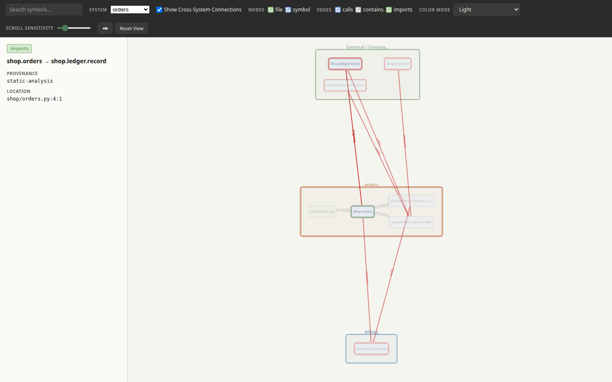

# Minotaur

Minotaur turns source code into an evidence-backed map without importing or
running the project. Identify callers and dependencies, group files into named
systems, inspect the connections that cross their boundaries, and compare how
those structures change as the code evolves.

Analysis stays on your machine and works offline. The standalone HTML explorer
also makes no network requests, so source evidence does not need to be sent to
another service. At a given source snapshot, Minotaur applies stable ordering
and produces repeatable graph and query results. Use focused CLI queries when
you need a direct answer, or open the same graph as an interactive HTML page.
Results retain source locations for inspection, and references that cannot be
resolved remain visible instead of being silently treated as confirmed
connections.

[](https://d10-analytics.github.io/Minotaur/)

[Try the live demo](https://d10-analytics.github.io/Minotaur/) or
[download and open the offline HTML](examples/python-workflow/minotaur-graph.html).
The preview selects the call from `select_sources` to `_resolve_target`, with
its supporting source visible in the details panel.

## What you can do

- **Find callers.** Use `callers` to locate calls to a function, `definitions`
  to find a declaration, and `context` to read source around a reported location.
- **Investigate change impact.** `impact` traces incoming calls and imports,
  showing dependencies by distance so you can decide which code to inspect next.
- **Inspect subsystem consumers.** Declare which files belong to each system.
  `consumers` shows outside files that use it, `surface` shows symbols they reach,
  and `system-deps` shows its outgoing dependencies. `systems` summarizes the
  declarations and how much of their source is represented in the graph.
- **Compare structural changes.** Ordinary `query diff` compares symbols and
  relationships in graph snapshots. In a configured Git repository,
  `query diff --systems` compares subsystem connections, consumers, and
  exposed symbols between two analyzed source revisions — either `HEAD` versus
  the working tree or an explicit historical pair such as two tags — including
  internal and call-expression changes and files moved between system
  definitions. Add `--html comparison.html` to save a self-contained offline
  visual report that retains the revision identities it was generated from. See
  the shop walkthrough's
  [plain-language comparison](examples/system-walkthrough/README.md#3-see-what-changed).
- **Find potentially unused symbols.** `unreferenced` gives you candidates to
  investigate. An absent reference does not prove that code is safe to delete.
- **Explore visually.** Search, filter, zoom, and select nodes or connections to
  inspect their details and source evidence. The self-contained HTML explorer
  opens locally without a server or network requests. The bundled
  [shop system walkthrough](examples/system-walkthrough/README.md#explore-system-boundaries-visually)
  demonstrates system focus and cross-system connections.

## Map systems and their boundaries

A system is an explicitly named set of files: a service, package, application
layer, or any other boundary that matters to your repository. Minotaur computes
connections from the analyzed source; system definitions select which files
belong together but do not contain a hand-maintained dependency diagram.

Projects normally keep one definition per system under `docs/systems`, while
`systems_dir` allows another parent directory when that better fits the
repository:

```toml
[minotaur]
schema_version = 1
root = "."
graph = "minotaur-graph.json"
targets = ["src"]
systems_dir = "docs/systems"
```

From that shared configuration, `systems` inventories coverage, `consumers`
finds outside files that use a system, `surface` identifies the system symbols
they reach, and `system-deps` reports outgoing dependencies. The HTML explorer
uses the same definitions to focus one system, reveal directly connected
outside nodes, and highlight boundary-crossing relationships.

[](examples/system-walkthrough/minotaur-graph.html)

The bundled [shop walkthrough](examples/system-walkthrough/README.md) is a
small runnable example with `orders`, `billing`, and deliberately unassigned
shared files. Its [comparison section](examples/system-walkthrough/README.md#3-see-what-changed)
shows how a new call, a moved symbol, and a removed file change consumers,
dependencies, and reported boundaries. It links a saved
[offline comparison report](examples/system-walkthrough/minotaur-comparison.html)
that compares two tagged revisions and names both revisions with their resolved
commit IDs.

## A small example

In the bundled [greeting program](examples/getting-started/app.py), `greeting`
returns a message and `welcome` calls it with `"Ada"`. After completing
[Quick start](#quick-start), the walkthrough runs this sequence inside its
new temporary directory containing a copy of `app.py`:

```text
$ minotaur analyze --root . --output graph.json --force app.py
exit: 0
$ minotaur query definitions greeting --graph graph.json --root . --no-refresh
app.py:4  app.greeting  function
exit: 0
$ minotaur query callers app.greeting --graph graph.json --root . --no-refresh
app.py:11:12  app.welcome
exit: 0
$ minotaur visualize --input graph.json --output graph.html --source-root .
exit: 0
```

`app.py:11:12` means file `app.py`, line 11, column 12 (both counted from one).
`app.welcome` is the caller: function `welcome` in module `app`. The definition
is on line 4. The runner prints `exit: 0` for a successful command; analysis
and visualization themselves are silent on success. `--no-refresh` reads the
saved graph without regenerating it.

For a larger example, the bundled [shop](examples/system-walkthrough/README.md)
defines orders and billing as separate systems. `complete_order` in
`shop/orders.py` calls `charge` in `shop/billing.py`. That makes orders a
consumer of billing and billing a dependency of orders. The walkthrough shows
those connections, then [adds a refund call](examples/system-walkthrough/README.md#3-see-what-changed)
and explains the boundary changes in plain language.

## Quick start

Start with Python **3.10 or newer** and a local checkout of this repository.
Open a terminal in the repository directory (the directory containing
`pyproject.toml`). Check your interpreter with `python3 --version` on Linux
or macOS, or `py -3 --version` on Windows.

Create and activate a virtual environment, which keeps this project's Python
dependencies separate from other projects:

```bash
# Linux/macOS (bash or zsh)
python3 -m venv .venv
source .venv/bin/activate
```

```powershell
# Windows PowerShell
py -3 -m venv .venv
.\.venv\Scripts\Activate.ps1
```

If PowerShell blocks activation, use `.\.venv\Scripts\python.exe` instead
of `python` in the commands below; changing your execution policy is unnecessary.
Once activated, `python` refers to the environment's interpreter. Install Minotaur:

```bash
python -m pip install -e .
python -m minotaur --help
```

An editable install makes commands use the source in this checkout, so edits
are available without reinstalling. `python -m` runs a Python module; the
installed `minotaur` command runs the same CLI.

From the same repository directory, run the first walkthrough:

```bash
python examples/run_walkthrough.py python
```

It copies the greeting program into a new temporary directory, analyzes it into
`graph.json` and a digest sidecar, runs the queries shown above, and creates
`graph.html` with source excerpts. It prints commands, results, exit statuses,
and a local URL to open in your browser. Press Enter when you finish viewing;
the runner removes its temporary directory and leaves bundled files untouched.
The [first Python graph guide](examples/getting-started/README.md) explains each
step and how to keep a scratch copy for experiments.

## Supported behavior and limitations

Minotaur analyzes Python (`.py`), JavaScript (`.js`), or the bounded T-SQL
subset (`.sql`), one language per invocation. Answers depend on the files you
select and the relationships the analyzer can establish. See the [Python
analysis guide](docs/guides/analyze-python.md), [JavaScript analysis guide](docs/guides/analyze-javascript.md),
and [T-SQL analysis guide](docs/guides/analyze-sql.md) for supported constructs
and resolution limits.

A source connection does not prove that a call runs in a particular scenario,
what target dynamic dispatch chooses, or whether an operation succeeds.
Minotaur does not execute the project or observe runtime behavior. Unresolved
references remain visible; `callers` also includes explicitly marked unresolved
name matches as leads to inspect, not confirmed calls to the requested target.

Queries use graph snapshots. By default, queries that support refresh check
for source drift and can regenerate the graph; `--no-refresh` keeps the saved
snapshot. Read the [freshness guide](docs/concepts/freshness.md) for what is
checked and what falls outside that boundary.

[Project configuration](docs/guides/project-configuration.md) saves defaults
such as source paths and graph location. Committing a graph and its digest
sidecar alongside source is an optional repository workflow; configuration
does not commit files for you. For that workflow, review regenerated artifacts
with source changes. Unchanged analyzed content keeps existing artifact bytes
and last-generation Git provenance.

## Further reading

- [Query walkthrough](examples/query-walkthrough/) and [command reference](docs/guides/query-reference.md): navigate source and compare snapshots.
- [System definitions](docs/guides/system-definitions.md) and the [shop walkthrough](examples/system-walkthrough/README.md): group files, inspect their boundaries, and compare changes.
- [HTML visualization guide](docs/guides/customize-html-visualization.md): create an explorer and control embedded source excerpts.
- [Python workflow example](examples/python-workflow/README.md): reproduce the bundled graph, HTML, and screenshot.
- [Purpose and boundary](docs/concepts/purpose.md) and [graph format reference](docs/formats/minotaur-graph-v1.md): understand the structural model and evidence categories.

## Contributing

Start with the [contributor reading guide](docs/guides/contributing.md) for
development installation, a trace through the implementation, and local checks.
Before adding a language interpreter or visualization feature, specify its
behavior and evidence model and test it against synthetic public fixtures.

## License

Minotaur is released under the [MIT License](LICENSE).
