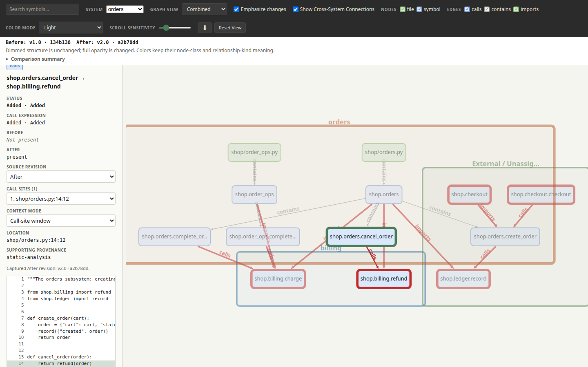

# Understand and compare systems

This example uses a small online shop to answer three practical questions:

- **What parts make up this project?** See `orders` and `billing` as separate
  systems, alongside shared files that belong to neither system.
- **Where do those parts connect?** Focus the map on one system and reveal the
  calls and imports that cross its boundary.
- **What changed?** Add a refund request from Orders to Billing and compare it
  with the committed version of the project.

Start with the visual map below. You do not need to understand every command
or output field to follow the example. The longer command transcripts later
on this page are an optional reference for readers who want to reproduce or
automate the checks.

Nothing here is a real product. The source, definitions, and generated files
are all public example artifacts.

The concept is documented in [Purpose and boundary](../../docs/concepts/purpose.md),
the query model in [System definitions](../../docs/guides/system-definitions.md),
the committed file contract in
[system definition format v1](../../docs/formats/system-definition-v1.md), and
the per-command options in the [query reference](../../docs/guides/query-reference.md).

## 1. See the current architecture

[](minotaur-graph.html)

Open [the interactive system map](minotaur-graph.html) directly from the
checkout. It works offline and makes no network requests.

The map shows three groups:

- **Orders** creates and completes customer orders.
- **Billing** charges an order and records the transaction.
- **External / Unassigned** contains the checkout and shared ledger files,
  which are deliberately not assigned to either named system.

The red lines cross a system boundary. They make it possible to see, for
example, that Orders depends on Billing without reading every source file.

## 2. Find a system boundary

In the map:

1. Choose **orders** from the **System** menu.
2. Enable **Show Cross-System Connections**.
3. Select a node or connection when you want its source location and evidence.

The focused map keeps Orders in the center and reveals only the directly
connected surroundings:

- Billing appears because Orders calls `charge`.
- The shared ledger appears because Orders records completed work there.
- Checkout appears because it calls into Orders.

This is the visual form of three questions available from the command line:

- `consumers`: Which outside files use this system?
- `surface`: Which symbols in this system do they reach?
- `system-deps`: Which other systems or shared files does this system use?

## 3. See what changed

Minotaur can compare two revisions without a saved graph. It analyzes the
source that belongs to each side with the same installed Minotaur version, so
the answer cannot go stale merely because a graph was not regenerated. There
are two workflows:

- **HEAD versus working tree** compares the committed source at `HEAD` with the
  source in your working tree — the convenient way to review uncommitted work.
- **An explicit historical pair** compares two revisions you name, such as two
  tags, branches, or commit IDs.

Both forms accept `--system`, `--details`, `--json`, and `--html PATH` for a
self-contained offline report, and both exit `1` when they succeed and find
changes.

The included scenario commits a baseline and tags it `v1.0`, then applies one
change set and tags it `v2.0`. In plain language, the change set means:

- Orders gains a new reason to depend on Billing: a `cancel_order` function
  imports and calls Billing's new `refund`.
- `shop/orders.py` stops being a consumer of Billing's `charge`, and the new
  `shop/order_ops.py` becomes one instead.
- Billing's `charge` changes the value it passes to the shared ledger; the call
  still resolves, so it is a changed call expression rather than a new call.
- `complete_order` moves from `shop/orders.py` to the new `shop/order_ops.py`
  in the same Orders system, so the old symbol is removed and a new one added.
- The unassigned `shop/checkout.py` file is deleted, so its module, symbol, and
  the Orders surface it reached are removed.

Run the complete scenario in a disposable temporary repository:

```bash
python examples/run_walkthrough.py systems
```

The important part of the historical result is:

```text
membership changed: shop/order_ops.py — unassigned -> orders
surface added: billing shop/billing.py.shop.billing.refund
surface removed: orders shop/orders.py.shop.orders.create_order
consumer added: billing <- shop/order_ops.py
consumer changed: billing <- shop/orders.py
consumer removed: billing <- shop/checkout.py
consumer removed: orders <- shop/checkout.py
dependency changed: orders -> billing
boundary added: orders.shop.orders.cancel_order -> billing.shop.billing.refund (calls)
boundary removed: orders.shop.orders.complete_order -> billing.shop.billing.charge (calls)
```

The runner prints the complete report, including the internal call-expression
change and the moved symbol, for both the working-tree and historical commands.

The runner creates and removes only its own temporary directory; it does not
edit this checkout or change your Git configuration. It fixes the commit
author, committer, and timestamps, so the two revision IDs are reproducible.
The comparison itself is read-only: it analyzes each captured revision in
memory without rewriting the saved graph or its checksum.

A difference returns status `1`; in this command that means "changes found,"
not "the comparison failed" — including when `--html` successfully writes a
report. Invalid input or an unusable comparison returns status `2`. When call
evidence is unavailable on a side, the report prints a limitation notice rather
than calling the call unchanged or changed.

[](minotaur-comparison.html)

Open [the saved comparison report](minotaur-comparison.html) to explore the
difference offline. Use **Graph view** to switch the whole map between
**Combined**, **Before**, and **After**, and **Emphasize changes** to dim
unchanged structure. Selecting a changed call opens its details, where a
separate **Source revision** switch changes only the captured source excerpt,
not the graph view. The saved report is static: it keeps the revisions it was
generated from and does not observe later working-file changes.

The [comparison reference](comparison.md) records the exact setup, source edits,
commands, identities, exit behavior, evidence limits, and regeneration steps
used by the runner.

## How this example is organized

```text
examples/system-walkthrough/
├── .minotaur.toml                           shared project configuration
├── README.md                                this walkthrough
├── minotaur-graph.json                      committed analysis of shop/,
├── minotaur-graph.json.sha256                trusted-load stamp
├── minotaur-graph.html                       portable system explorer
├── minotaur-comparison.html                  saved offline comparison of
│                                             the v1.0 and v2.0 revisions
├── comparison.md                             comparison command reference
├── shop/                                    the fabricated storefront package
│   ├── __init__.py
│   ├── billing.py                           declared system "billing"
│   ├── checkout.py                          no declared system
│   ├── ledger.py                            no declared system
│   └── orders.py                            declared system "orders"
├── docs/systems/                            committed system definitions
│   ├── billing/
│   │   ├── system.toml
│   │   └── README.md                        human narrative, ignored
│   └── orders/
│       ├── system.toml
│       └── README.md                        human narrative, ignored
└── regenerate_system_walkthrough.py         reproduces the graph, explorer,
                                              and comparison report
```

The local `.minotaur.toml` makes one project contract authoritative for the
source root, analysis targets, graph, and system-definition directory. Its
`systems_dir = "docs/systems"` uses the recommended layout; another project
can keep the same per-system directories under a different configured parent.

Every query command below runs from the repository root and reads the
committed graph with `--no-refresh`, so a walkthrough never rewrites a
checked-in file. `--root examples/system-walkthrough` is the source root the
graph was analyzed against; the definitions are found at that root's default
`docs/systems` location.

### The declared systems

Each system is one directory under `docs/systems/` holding one machine-readable
`system.toml`:

```toml
# docs/systems/orders/system.toml
schema_version = 1
name = "orders"
files = ["shop/orders.py"]
```

```toml
# docs/systems/billing/system.toml
schema_version = 1
name = "billing"
files = ["shop/billing.py"]
```

A definition names a unique system and lists the individual files that belong
to it — nothing else. The `README.md` files inside the system directories are
human narrative; Minotaur reads and validates only each `system.toml`.
Membership is the exact test "is this file listed": `checkout.py` and
`ledger.py` are listed by no system and are therefore `no_system` files.

### Rebuild the generated files

`minotaur-graph.json` was produced by the public `analyze` command shown here,
with only volatile Git snapshot metadata removed so the committed bytes stay
reproducible across commits. Re-run the same command against a scratch path and
`diff` the result against the checked-in graph to confirm they agree:

```console
$ minotaur analyze --root examples/system-walkthrough \
    --output /tmp/system-walkthrough-graph.json \
    --force examples/system-walkthrough/shop
$ minotaur query diff examples/system-walkthrough/minotaur-graph.json \
    /tmp/system-walkthrough-graph.json
no changes
```

A successful `analyze` is silent on standard output. The
[regenerate script](regenerate_system_walkthrough.py) automates this sequence
(including re-stamping the sidecar, rebuilding the HTML explorer, and writing
the comparison report) when the fabricated sources or the comparison scenario
change:

```bash
$ python3 examples/system-walkthrough/regenerate_system_walkthrough.py
```

The comparison report is generated from a disposable repository whose commits
use a fixed identity and timestamp, so its revision IDs stay stable. Use
`--comparison-only` to rebuild just that report, or `--skip-comparison` to
rebuild just the graph, sidecar, and explorer.

### Regenerate the documentation screenshots

To regenerate the documentation screenshots from the checked-in HTML, install
the visualizer dependencies and run:

```bash
python3 scripts/capture_system_walkthrough_demo.py
python3 scripts/capture_system_walkthrough_demo.py --comparison
```

The first command focuses `orders`, enables its cross-system connections, and
writes `docs/assets/system-walkthrough-demo.png`. The `--comparison` command
captures `minotaur-comparison.html` with the combined diff and a selected
boundary call, and writes `docs/assets/system-comparison-demo.png`. Both use a
fixed viewport.

## Command reference: inspect the current boundary

The sections below preserve exact, reproducible output. They are useful when
you want to automate a query or understand its detailed fields; they are not
required before using the visual map or the comparison scenario.

### `surface`: what outside files reach into the system

`surface` answers: which in-scope symbols do files outside the system reach
through `calls`, `references`, `sql:reads-from`, or `sql:foreign-key-to`?
Importing the system's module is a consumer fact, never an exposed boundary, so an outside
file that only imports `shop.orders` would expose nothing.

```console
$ minotaur query surface orders \
    --graph examples/system-walkthrough/minotaur-graph.json \
    --root examples/system-walkthrough --no-refresh
coverage {"declared_files":{"absent":0,"represented":1,"scope":"selected_system_declared_files","total":1},"graph_files":{"count":5,"scope":"final_graph_file_nodes"},"recorded_unresolved_references":{"count":0,"scope":"selected_system_declared_files"},"selection":{"status":"recorded","targets":["shop"]},"source_diagnostics":{"status":"unavailable"}}
shop/orders.py  shop.orders.create_order  calls
```

The storefront checkout creates orders, so `create_order` is the one exposed
symbol; `complete_order` is only ever called from inside the system and is
internal. The same records as JSON:

```console
$ minotaur query surface orders \
    --graph examples/system-walkthrough/minotaur-graph.json \
    --root examples/system-walkthrough --no-refresh --json
{"coverage":{"declared_files":{"absent":0,"represented":1,"scope":"selected_system_declared_files","total":1},"graph_files":{"count":5,"scope":"final_graph_file_nodes"},"recorded_unresolved_references":{"count":0,"scope":"selected_system_declared_files"},"selection":{"status":"recorded","targets":["shop"]},"source_diagnostics":{"status":"unavailable"}},"query":"surface","refreshed":false,"results":[{"category":"system: orders","kinds":["calls"],"path":"shop/orders.py","symbol":"shop.orders.create_order"}],"stale":[]}
```

Opt in to relationship evidence when an exact graph join and source location
are needed:

```console
$ minotaur query surface orders \
    --graph examples/system-walkthrough/minotaur-graph.json \
    --root examples/system-walkthrough --no-refresh --details
coverage {"declared_files":{"absent":0,"represented":1,"scope":"selected_system_declared_files","total":1},"graph_files":{"count":5,"scope":"final_graph_file_nodes"},"recorded_unresolved_references":{"count":0,"scope":"selected_system_declared_files"},"selection":{"status":"recorded","targets":["shop"]},"source_diagnostics":{"status":"unavailable"}}
shop/orders.py  shop.orders.create_order  calls
relationships [{"evidence":[{"evidence_extensions":{"status":"unavailable"},"producer":{"name":"minotaur-python","status":"recorded","version":{"status":"unavailable"}},"provenance":"static-analysis","rule":{"status":"unavailable"},"sites":[{"coordinate_encoding":"utf-8","path":"shop/checkout.py","range":{"end":{"column":25,"line":8},"end_exclusive":true,"start":{"column":13,"line":8}}}]}],"kind":"calls","relationship_extensions":{"status":"unavailable"},"source":{"id":"node:sha256:99b2170760c1979d5601f6da9483153ac2da5ebfc7b071c4ecc53016c2e714b7","label":"shop.checkout.checkout","location":{"coordinate_encoding":"utf-8","path":"shop/checkout.py","range":{"end":{"column":25,"line":9},"end_exclusive":true,"start":{"column":1,"line":7}},"status":"recorded"},"node_class":"symbol","path":{"status":"recorded","value":"shop/checkout.py"},"semantic_identity":{"basis":"source-location","namespace":"minotaur-python","reference_text":{"status":"unavailable"},"resource_key":{"status":"unavailable"},"upstream_identifier":{"status":"unavailable"}}},"target":{"id":"node:sha256:5822107e1c8348278f492acfc50cb897197cd9ea9c52d307cf347ff0b2b0cc69","label":"shop.orders.create_order","location":{"coordinate_encoding":"utf-8","path":"shop/orders.py","range":{"end":{"column":17,"line":10},"end_exclusive":true,"start":{"column":1,"line":7}},"status":"recorded"},"node_class":"symbol","path":{"status":"recorded","value":"shop/orders.py"},"semantic_identity":{"basis":"source-location","namespace":"minotaur-python","reference_text":{"status":"unavailable"},"resource_key":{"status":"unavailable"},"upstream_identifier":{"status":"unavailable"}}}}]
```

### `consumers`: which outside files use the system

`consumers` answers: one record per outside file participating in a
boundary-crossing relationship, carrying the distinct relationship kinds that
file contributes (`calls`, `references`, `imports`, `sql:reads-from`, and
`sql:foreign-key-to`) and the concrete
in-scope targets it reaches:

```console
$ minotaur query consumers orders \
    --graph examples/system-walkthrough/minotaur-graph.json \
    --root examples/system-walkthrough --no-refresh
coverage {"declared_files":{"absent":0,"represented":1,"scope":"selected_system_declared_files","total":1},"graph_files":{"count":5,"scope":"final_graph_file_nodes"},"recorded_unresolved_references":{"count":0,"scope":"selected_system_declared_files"},"selection":{"status":"recorded","targets":["shop"]},"source_diagnostics":{"status":"unavailable"}}
shop/checkout.py (no_system)  calls: shop.orders.create_order (shop/orders.py); imports: shop.orders.create_order (shop/orders.py)
```

`checkout.py` is a `no_system` consumer: it imports `create_order` (module
layer) and calls it (symbol layer). If it had only imported the module without
a call that resolved, it would still be a consumer — through `imports` alone —
because linking against the system's module is itself a consumer fact.

```console
$ minotaur query consumers orders \
    --graph examples/system-walkthrough/minotaur-graph.json \
    --root examples/system-walkthrough --no-refresh --json
{"coverage":{"declared_files":{"absent":0,"represented":1,"scope":"selected_system_declared_files","total":1},"graph_files":{"count":5,"scope":"final_graph_file_nodes"},"recorded_unresolved_references":{"count":0,"scope":"selected_system_declared_files"},"selection":{"status":"recorded","targets":["shop"]},"source_diagnostics":{"status":"unavailable"}},"query":"consumers","refreshed":false,"results":[{"category":"no_system","file":"shop/checkout.py","kinds":["calls","imports"],"targets":[{"kind":"calls","label":"shop.orders.create_order","path":"shop/orders.py"},{"kind":"imports","label":"shop.orders.create_order","path":"shop/orders.py"}]}],"stale":[]}
```

Consumers of the billing system show both categories of consumer file: the
`no_system` checkout and `orders.py`, which belongs to the *other declared
system*:

```console
$ minotaur query consumers billing \
    --graph examples/system-walkthrough/minotaur-graph.json \
    --root examples/system-walkthrough --no-refresh
coverage {"declared_files":{"absent":0,"represented":1,"scope":"selected_system_declared_files","total":1},"graph_files":{"count":5,"scope":"final_graph_file_nodes"},"recorded_unresolved_references":{"count":0,"scope":"selected_system_declared_files"},"selection":{"status":"recorded","targets":["shop"]},"source_diagnostics":{"status":"unavailable"}}
shop/checkout.py (no_system)  calls: shop.billing.charge (shop/billing.py); imports: shop.billing.charge (shop/billing.py)
shop/orders.py (system: orders)  calls: shop.billing.charge (shop/billing.py); imports: shop.billing.charge (shop/billing.py)
```

### `system-deps`: what the system itself reaches

`system-deps` answers: which target categories the system's own files reach
through outgoing `calls`, `references`, `imports`, `sql:reads-from`, and
`sql:foreign-key-to` — other named systems, plus the explicit `no_system`
category for path-carrying targets in no declared system and `external` for
path-less upstream targets. The orders
subsystem charges orders through billing and appends to the shared ledger:

```console
$ minotaur query system-deps orders \
    --graph examples/system-walkthrough/minotaur-graph.json \
    --root examples/system-walkthrough --no-refresh
coverage {"declared_files":{"absent":0,"represented":1,"scope":"selected_system_declared_files","total":1},"graph_files":{"count":5,"scope":"final_graph_file_nodes"},"recorded_unresolved_references":{"count":0,"scope":"selected_system_declared_files"},"selection":{"status":"recorded","targets":["shop"]},"source_diagnostics":{"status":"unavailable"}}
no_system  calls: shop.ledger.record (shop/ledger.py); imports: shop.ledger.record (shop/ledger.py)
system: billing  calls: shop.billing.charge (shop/billing.py); imports: shop.billing.charge (shop/billing.py)
```

```console
$ minotaur query system-deps orders \
    --graph examples/system-walkthrough/minotaur-graph.json \
    --root examples/system-walkthrough --no-refresh --json
{"coverage":{"declared_files":{"absent":0,"represented":1,"scope":"selected_system_declared_files","total":1},"graph_files":{"count":5,"scope":"final_graph_file_nodes"},"recorded_unresolved_references":{"count":0,"scope":"selected_system_declared_files"},"selection":{"status":"recorded","targets":["shop"]},"source_diagnostics":{"status":"unavailable"}},"query":"system-deps","refreshed":false,"results":[{"category":"no_system","targets":[{"kind":"calls","label":"shop.ledger.record","path":"shop/ledger.py"},{"kind":"imports","label":"shop.ledger.record","path":"shop/ledger.py"}]},{"category":"system: billing","targets":[{"kind":"calls","label":"shop.billing.charge","path":"shop/billing.py"},{"kind":"imports","label":"shop.billing.charge","path":"shop/billing.py"}]}],"stale":[]}
```

No target is silently attributed to a system: an unlisted path-carrying target
is reported under `no_system`, never guessed into one of the named systems.
Billing's own dependencies go only to the shared ledger, so its `system-deps`
has a single `no_system` row:

```console
$ minotaur query system-deps billing \
    --graph examples/system-walkthrough/minotaur-graph.json \
    --root examples/system-walkthrough --no-refresh
coverage {"declared_files":{"absent":0,"represented":1,"scope":"selected_system_declared_files","total":1},"graph_files":{"count":5,"scope":"final_graph_file_nodes"},"recorded_unresolved_references":{"count":0,"scope":"selected_system_declared_files"},"selection":{"status":"recorded","targets":["shop"]},"source_diagnostics":{"status":"unavailable"}}
no_system  calls: shop.ledger.record (shop/ledger.py); imports: shop.ledger.record (shop/ledger.py)
```

```console
$ minotaur query surface billing \
    --graph examples/system-walkthrough/minotaur-graph.json \
    --root examples/system-walkthrough --no-refresh
coverage {"declared_files":{"absent":0,"represented":1,"scope":"selected_system_declared_files","total":1},"graph_files":{"count":5,"scope":"final_graph_file_nodes"},"recorded_unresolved_references":{"count":0,"scope":"selected_system_declared_files"},"selection":{"status":"recorded","targets":["shop"]},"source_diagnostics":{"status":"unavailable"}}
shop/billing.py  shop.billing.charge  calls
```

### Empty results are answers, not errors

A system whose boundary has no matches prints its own empty text form — `no
exposed symbols`, `no consumers`, or `no dependencies` — and still exits `0`.
Declared files that the analyzed graph does not contain are reported as
`minotaur: warning:` lines on standard error, never silently dropped; an
unknown system name exits `2` with the nearest declared systems.

For exact comparison setup and automation details, continue to the
[comparison reference](comparison.md).
